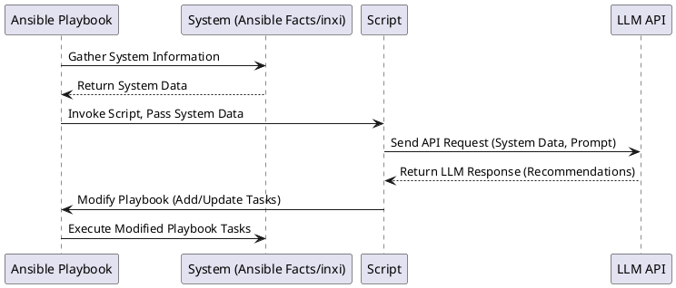
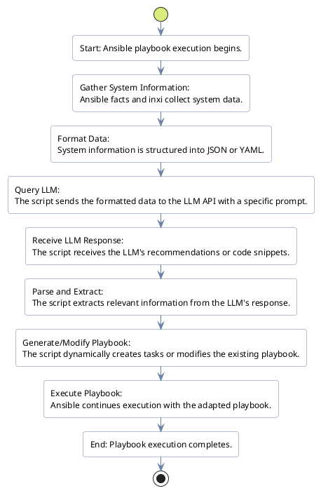

<h2>Syncopated OS</h2>

An exercise in using Ansible for Workstation Provisioning & Configuration Management

## Introduction

This whole thing, I had to decide, sometime in or around about 2021 as a personal "solution" to "manage" the complex configurations and package dependencies in Linux audio environments. Given the time and effort I was putting into the system, I felt it necessary to start leveraging DevOps principles, and so the project evolved into an Ansible collection aimed at streamlining the Linux audio experience.

### 2021: Project Inception

- Initial development of Ansible roles for basic audio configuration
- Establishment of core system management tasks

### 2022: Expansion and Refinement

- Introduction of specialized roles for various audio applications
- Established configurations for networked audio using JackTrip
- Implemented networked KVM setups using Barrier KVM software

### 2023: Modularization and Focus on Arch Linux

- Significant increase in role granularity for enhanced flexibility
- Shift towards Arch Linux focus for improved maintainability and development efficiency
- Addition of system tuning and performance optimization roles

### 2024: AI Integration and Documentation Overhaul

- Integration of AI-related plugins (langchain, openai_chat)
- Conceptualization of LLM-based interactive documentation and role expansion

## Feature Evolution and Distribution Choice

The project initially aimed for multi-distribution support but later focused specifically on Arch Linux. This choice was made after careful consideration of various factors:

1. **Clean and Minimal Foundation**: Arch Linux provides a clean and minimal base, which is ideal for laying down a stable foundation for audio work.

2. **Development Efficiency**: The rolling release model makes it easier to work with the latest software versions and libraries, crucial in the evolving landscape of audio software.

3. **Arch Labs Installer**: The efficiency and minimal footprint of the Arch Labs installer streamlined the setup process.

4. **Community Repository Structure**: Arch's community repository facilitates testing newer software, beneficial for a development-focused distribution.

5. **Library Dependencies**: Managing library dependencies for various audio software is generally easier on Arch Linux.

The choice of Arch Linux came after experience with other distributions, including Fedora, which was initially used in many DevOps projects. However, challenges in using Fedora as a development platform for an independent project led to the shift to Arch Linux.

## Community Collaboration vs. Independent Development

The development of Syncopated Linux has been accompanied by careful consideration of the existing open-source landscape, particularly in the realm of Linux audio projects. This reflection process has been crucial in shaping the project's direction and scope.

### Consideration of Existing Projects

- **AV Linux**: Recognized for its comprehensive approach to audio production on Linux, particularly its extensive documentation and user-friendly desktop environment.
- **Other Audio-Focused Distributions**: Awareness of various projects tackling similar challenges in the Linux audio ecosystem.

### The Decision Process

1. **Not Reinventing the Wheel**: A strong belief in leveraging existing solutions where possible, acknowledging the valuable work done by other projects.

2. **Unique Focus**: Identifying gaps in existing solutions, particularly in the area of live performance and high-availability setups for audio production.

3. **Leveraging Specific Expertise**: Recognizing the potential to apply enterprise architecture principles to live audio scenarios, offering a unique perspective.

4. **Documentation Challenges**: Acknowledging the impressive documentation efforts of projects like AV Linux, while also recognizing personal limitations in creating similar comprehensive manual documentation.

5. **Innovation Opportunity**: Identifying the potential to innovate in areas like AI-assisted documentation and configuration, which could benefit the broader Linux audio community.

### Outcome

After careful consideration, the decision was made to continue with Syncopated Linux as an independent project, but with a strong emphasis on:

1. **Complementing Existing Solutions**: Focusing on areas not extensively covered by other projects, particularly live performance scenarios.

2. **Open Collaboration**: Maintaining openness to collaboration with existing projects and the wider Linux audio community.

3. **Unique Contribution**: Developing innovative approaches, especially in AI-assisted documentation and system configuration, that could potentially benefit other projects in the future.

4. **Community Engagement**: Actively seeking feedback and contributions from users and other developers in the Linux audio ecosystem.

This approach allows Syncopated Linux to carve out its own niche while remaining respectful of and complementary to existing efforts in the Linux audio community. It also leaves the door open for future collaborations or integration with other projects as the landscape evolves.

## Vision for Live Performances

A key consideration in the development of Syncopated Linux is its potential use in live performance settings. The project aims to create a stable platform suitable for:

- Using computers as instruments in live performances
- Integrating tools like Sonic Pi for live coding music
- Implementing effects that can be manipulated with string instruments or other controllers
- Ensuring system stability for reliable performance in front of an audience

This focus on stability and performance reliability is crucial, as any system failures during a live performance could be catastrophic.

## Challenges & Solutions

A major challenge was balancing multi-distribution support with project maintainability. This was addressed by focusing on Arch Linux while developing a framework that could potentially be extended to other distributions in the future. The project adapted by adopting a modular role structure, enabling quick updates and additions without disrupting the overall framework.

## Current State and Future Vision

As of 2024, Syncopated Linux has evolved into an Ansible collection designed to configure audio production environments on Arch Linux, based on the developer's specific setup. The project currently includes:

- A set of roles for audio, desktop, development, and system configuration
- Custom plugins for automation tasks
- Group variable management for configuration flexibility

It's important to note that while the project aims to support advanced audio production environments, its effectiveness across a wide range of setups has not yet been extensively tested by other users.

Future developments focus on:

- Creating comprehensive documentation to facilitate testing and contributions from the community
- Leveraging AI to extend the project's capabilities
- Developing LLM-based interactive documentation for improved user experience
- Creating an AI-assisted framework for users to easily add support for additional configurations or hardware
- Enabling users to query an LLM to adaptively create and place new tasks within the existing framework
- Further optimizing the system for various audio production scenarios, including live performance

The immediate goal is to lay out a clear plan and documentation, which will enable other users to test the system across different setups and provide valuable feedback. This collaborative approach will be crucial in refining the project and validating its capabilities across a broader range of audio production environments.

This approach aims to develop a robust, flexible, and user-friendly system that can potentially meet the demands of both studio production and live performance environments, subject to thorough testing and community validation.

# demo playbook run

* * *

## Backlog

## Epic: Decouple Package Installation and Enhance Distribution Compatibility**

*User Story:* As a DevOps engineer, I want to run my Ansible playbooks on various Linux distributions without errors so that I can manage servers in diverse environments.

### Walk 1: Decouple Package Installation

| Task   | Description                                                                                                 |
|--------|-------------------------------------------------------------------------------------------------------------|
| Task 1 | Research and select a distribution-agnostic package manager module (e.g., `package`)                        |
| Task 2 | Refactor playbooks to use the chosen module instead of distribution-specific commands.                      |
| Task 3 | Create a mapping between package names and their equivalents across target distributions (if necessary).    |
| Task 4 | Implement logic to dynamically determine the correct package names based on the target host's distribution. |
| Task 5 | Update tests to cover multiple distributions and ensure consistent package installation.                    |

### Walk 2: Generalize Host-Specific Configurations

| Task   | Description                                                                                                             |
|--------|-------------------------------------------------------------------------------------------------------------------------|
| Task 6 | Identify templates and conditionals that rely on host-specific circumstances (e.g., file paths, service names).         |
| Task 7 | Research and implement Ansible facts or variables to dynamically adapt configurations based on the target distribution. |
| Task 8 | Refactor existing templates and conditionals to use these dynamic values.                                               |
| Task 9 | Thoroughly test playbooks on different distributions to validate the generalized configurations.                        |

**Future Considerations:**

* **Containerization:** Explore containerizing your applications to further abstract away distribution differences.
* **Roles:**  Structure your playbooks using Ansible roles to improve organization and reusability across projects.

---

## Epic:  Develop LLM-Enhanced Ansible Framework for Dynamic System Configuration

*User Story: As a DevOps engineer, I want an Ansible framework that leverages a large language model (LLM) to automatically adapt playbooks to diverse system configurations, reducing manual effort and improving compatibility.*

Walk 1:  System Information Gathering and LLM Integration

* **Task 1:** Research and select a suitable LLM (e.g., OpenAI, Google Cloud AI, local LLM) based on capabilities, cost, and security considerations.
* **Task 2:** Create an Ansible role or module to gather comprehensive system information using Ansible facts and `inxi`.
* **Task 3:** Develop a secure and reusable script (e.g., Python) to interact with the chosen LLM's API.
* **Task 4:** Design and implement a mechanism for securely storing and retrieving LLM API keys or credentials.
* **Task 5:**  Create initial LLM prompts for common system configuration tasks (e.g., package installation, service optimization).

Walk 2: Dynamic Playbook Generation and Modification

* **Task 6:** Develop Python logic to parse and extract relevant information (recommendations, code snippets) from the LLM's API response.
* **Task 7:** Implement functionality to dynamically generate Ansible tasks based on the extracted LLM recommendations.
* **Task 8:**  Create mechanisms to insert dynamically generated tasks into existing Ansible playbooks or modify existing task parameters.
* **Task 9:** Implement error handling and logging for LLM API interactions and playbook modifications.
* **Task 10:** Develop unit tests to validate the accuracy and reliability of playbook generation and modification logic.

Walk 3:  Testing, Validation, and Refinement

* **Task 11:** Set up diverse test environments (different Linux distributions, hardware configurations) to rigorously test the framework.
* **Task 12:**  Develop integration tests to validate end-to-end functionality, from information gathering to playbook execution.
* **Task 13:**  Refine LLM prompts and playbook generation logic based on test results and real-world use cases.
* **Task 14:** Implement a feedback mechanism (e.g., logging, user input) to capture and address edge cases or unexpected LLM responses.
* **Task 15:**  Document the framework's usage, configuration options, and best practices.

## Flow Diagram

(Represent this visually with a flowcharting tool)

1. **Start:** Ansible playbook execution begins.
2. **Gather System Information:** Ansible facts and `inxi` collect system data.
3. **Format Data:** System information is structured into JSON or YAML.
4. **Query LLM:**  The script sends the formatted data to the LLM API with a specific prompt.
5. **Receive LLM Response:** The script receives the LLM's recommendations or code snippets.
6. **Parse and Extract:**  The script extracts relevant information from the LLM's response.
7. **Generate/Modify Playbook:** The script dynamically creates tasks or modifies the existing playbook.
8. **Execute Playbook:** Ansible continues execution with the adapted playbook.
9. **End:** Playbook execution completes.

## Sequence Diagram

**Important Considerations:**

* **Error Handling:**  Implement robust error handling at each stage (API calls, data parsing, playbook modification) to ensure graceful degradation and informative logging.
* **Security:** Prioritize security when handling LLM API keys and sensitive system information.
* **Testing:**  Thorough testing is crucial. Use a variety of test environments and real-world scenarios.
